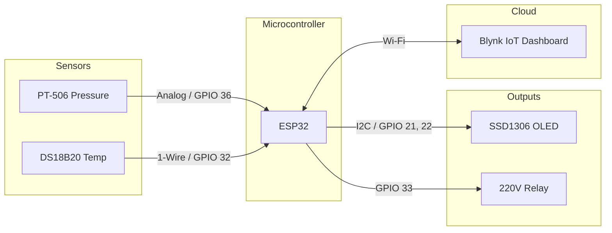

**Student Information**
* **Full Name:** Eray Soydal 
* **Student No:** 20230808605

## Project Summary
This project targets the automation and remote monitoring of borehole (sondaj) water pumps in agricultural fields to prevent water waste and pump damage. The IoT system, powered by an ESP32, monitors real-time water pressure using a PT-506 industrial transmitter and ambient temperature via a DS18B20 sensor. The cloud dashboard on Blynk IoT provides live visualization of sensor data and allows the user to remotely control the borehole pump via a relay. Additionally, the system tracks electricity status and pump feedback to ensure operational safety. Key features include a notification "Killswitch" for user alerts and a "Multi-WiFi" protocol for high availability in remote areas.

## Components List
1. **ESP32 Microcontroller** (30 PIN)
2. **PT-506 Pressure Transmitter** (Sensor 1 - Task: Monitoring pipe pressure, 0-10 bar range)
3. **Dallas DS18B20** (Sensor 2 - Task: 1-Wire digital temperature sensor for environment/control box)
4. **SSD1306 128x64 OLED Display** (I2C)
5. **220V Relay Module** (Actuator 1 - Task: Controlling the borehole pump motor)
6. *Additional circuit components: Voltage divider/isolation circuits for Electricity & Pump status sensing.*

## System Architecture & Wiring Table

**Wiring Diagram:** 

| ESP32 Pin | Component Pin | Description |
| :--- | :--- | :--- |
| **GPIO 36 (ADC1_CH0)** | PT-506 Signal | Reads analog voltage for water pressure |
| **GPIO 32** | DS18B20 Data | 1-Wire temperature data (requires 4.7kΩ pull-up) |
| **GPIO 33** | Relay IN | Actuator control to turn the borehole pump ON/OFF |
| **GPIO 21** | OLED SDA | I2C Data for the OLED screen |
| **GPIO 22** | OLED SCL | I2C Clock for the OLED screen |
| **GPIO 39** | Electricity Sensor| Analog/Digital read for grid power status |
| **GPIO 34** | Pump Status Sensor| Analog/Digital read to verify if pump is running |
| **3.3V / 5V** | VCC / VDD | Power supply to sensors/relay/OLED |
| **GND** | GND | Common Ground |

*Note: Connect the VCC/GND of the ESP32 to the respective VCC/GND pins on the sensors and OLED. Connect the 4.7kΩ pull-up resistor between GPIO 32 and 3.3V.*

## Cloud Setup (Blynk IoT)
*   **Platform:** Blynk IoT
*   **Template ID:** `TMPL6jYxEQC1m`
*   **Template Name:** Arazi Kontrol

### Variables, Feeds and Widgets
| Virtual Pin | Datastream Purpose | Recommended Dashboard Widget |
| :--- | :--- | :--- |
| **V1** | Water Pressure (`VP_PRESSURE`) | Gauge / Value Display |
| **V2** | Temperature (`VP_TEMP`) | Gauge / Labeled Value |
| **V3** | Grid Electricity (`VP_ELECTRICITY`) | LED / State Indicator |
| **V5** | Pump Status (`VP_SONDAJ`) | LED / State Indicator |
| **V10** | Force Refresh (`VP_FORCE_REFRESH`)| Button (Push, to trigger a data sync) |
| **V11** | Pump Control (`VP_SONDAJ_CONTROL`) | Switch (Controls the GPIO 33 Relay) |
| **V14** | Killswitch (`VP_NOTIFY_KILL`) | Switch (Toggles automatic anomaly notifications)|

## How to Run
1. **Libraries Required:** Install the following libraries via the Arduino IDE Library Manager:
   * `Blynk`
   * `OneWire`
   * `DallasTemperature`
   * `U8g2` (for OLED display)
2. **Board Settings:** 
   * Open `final_version-with oled.ino` (or the relevant `.ino` file) in the Arduino IDE.
   * Select the **ESP32 Dev Module** from `Tools > Board`.
3. **Configuration:**
   * Set `BLYNK_AUTH_TOKEN` at the top of the file to match your Blynk device token.
   * Update the `WifiCred wifiList[]` array with your primary and secondary Wi-Fi credentials for cloud connectivity.
4. **Deploy:** Connect the ESP32 via USB and click **Upload**.

## How It Works (Detailed Analysis)

**Data Processing & Noise Filtering:** 
The ESP32 acts as the central gateway. It samples the PT-506 analog signal 128 times per cycle to calculate a stable pressure value, applying advanced noise-floor filtering. The system utilizes a software-defined noise floor (0.3 bar); readings below this threshold are treated as zero to prevent "chatter" in the dashboard graphics.

**Anomaly Detection & Upload Logic:** 
The data is processed using a rolling buffer to detect significant pressure changes (delta) before publishing to Blynk Cloud. The borehole pump is protected by a 5-second comparison window logic, where the system analyzes pressure trends to detect anomalies such as dry running or pipe bursts. This minimizes data traffic while ensuring critical alerts are sent immediately.

**Multi-WiFi High Availability:** 
Technically, the system is designed for extreme reliability. The implementation of a "Multi-WiFi" protocol allows the device to automatically cycle through 5 different SSID credentials. This ensures the system stays online in remote areas even if the primary local network fails, smoothly falling back to secondary networks or mobile hotspots.

**Dashboard Control & NVS Killswitch:**
Through the Blynk IoT interface, users can remotely toggle the 220V relay (Virtual Pin V11) to control the borehole pump. Additionally, a significant part of the project focuses on user experience and safety: users can toggle a "Killswitch" (Virtual Pin V14) which stores a preference directly in the ESP32’s Non-Volatile Storage (NVS). This safely silences automated notifications during maintenance periods without stopping the continuous data flow.

**Local OLED Display:** 
In parallel with the cloud data upload, the ESP32 updates the I2C OLED screen locally every second with real-time diagnostic content: the current temperature, pressure, pump state, and Wi-Fi RSSI parameters.
## 7. Evidence
### Project Demo  : 

https://github.com/user-attachments/assets/f14f7579-fbfc-4ac1-8e0a-c01ea6017c40

